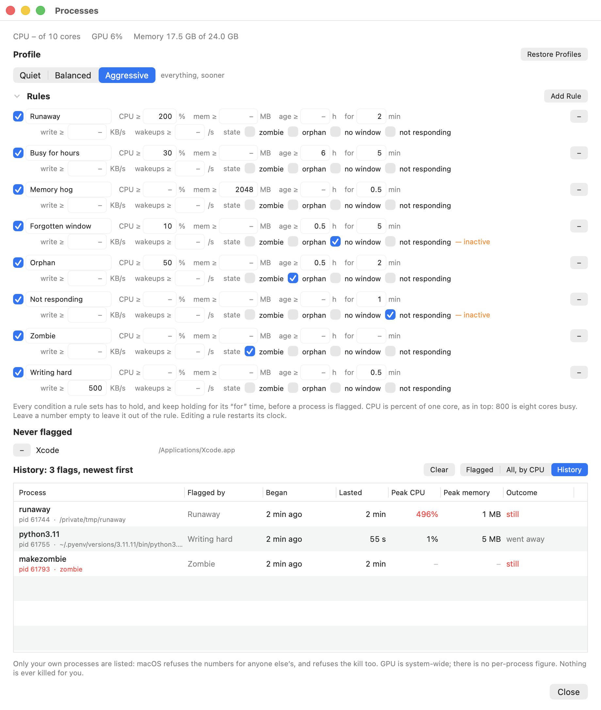

# macos-process-reaper — `Reaper`

**A menu bar watch for the processes nobody remembers starting: sustained CPU, memory, disk writes and wake-ups, plus the four broken states no threshold describes — zombie, orphan, windowless, not responding. It tells you, remembers what it told you, and never kills anything for you.** Needs no privileges, no daemon and no helper. Built on an M-series Mac and universal for Intel too.

[](https://github.com/beomwookang/macos-process-reaper/actions/workflows/build.yml)
[](#requirements)
[](#requirements)
[](app/)
[](#permissions)
[](tests/)
[](LICENSE)

> A Mac that is hot, or slow, or out of memory usually has one process behind it,
> and it is rarely the one you are looking at. It is the headless browser a
> script left behind, the build that never finished, the viewer still redrawing
> at full tilt for a window you closed hours ago. Activity Monitor will show you
> that process — once you think to go and look. The point of this is that you
> do not have to think to look.

The mark in the menu bar is calm until a rule holds, and red when one does. If
it is calm, the rules you chose have nothing to report. If it is red, something
is named one click away, with the reason it was named and a button that ends it.

---

## Why this exists

This started inside `macos-fan-control`, a sibling project, where a process
watch was added because the fan is downstream of everything else: a machine at
100 °C with nothing visibly running has a process someone forgot about. But that
watch shipped behind a fan curve, could not be installed without a root daemon
and a `sudoers` rule, and only described processes that were *busy* — never ones
that were simply *broken*.

This is that watch on its own, with the parts it was missing: the broken states,
a mark whose only job is to change colour, and profiles so the thresholds are a
choice rather than a configuration exercise.

## What you get

| | |
|---|---|
| A mark that means one thing | Calm, amber while a rule is counting, red with a count once one holds, faint while paused |
| Six things to measure | Sustained CPU, memory, uptime, disk write rate, idle wake-ups — each optional, all conjoined |
| Four kinds of broken | Zombie, orphan, windowless, not responding |
| Profiles, then rules | Pick Quiet, Balanced or Aggressive; the numbers underneath are there when you want them |
| Sustain, so a build is not a bug | A condition has to keep holding before anything is said about it |
| A memory | What was flagged, when, for how long, how bad it got, and whether you ended it |
| An escape hatch | Never flag this app, written against the bundle, so its helpers go too |
| Pause | Fifteen minutes, an hour or four, for deliberately running something that would trip everything |
| Detail when a row is not enough | Full command line, the chain of parents, threads, open files, disk, wake-ups, a CPU trace |
| No privileges | No daemon, no helper, no `sudo`, no root. Installing is copying the app |
| Nothing automatic | A rule flags. A person decides. There is no setting that changes this |

## Requirements

| | |
|---|---|
| macOS | 13 or later |
| Hardware | Apple Silicon or Intel (the bundle is universal) |
| Build tools | Xcode command line tools (`swiftc`, `lipo`, `codesign`) |
| Privileges | None to run. `make install` writes to `/Applications`, which may ask for your password |

## Install

Build it on the machine you will run it on. The bundle is ad-hoc signed, so a
copy transferred from elsewhere picks up a quarantine flag and macOS refuses to
launch it.

```sh
git clone <this repo>
cd mac-process-reaper
make
make install          # copies build/Reaper.app to /Applications
open /Applications/Reaper.app
```

A mark appears in the menu bar. There is nothing else to set up. To have it come
back after a restart, use **Start at Login** in its menu.

Turn that on from the copy you intend to keep. The login item records the path
of the running bundle, so switching it on while running `build/Reaper.app`
writes that path — and `make clean` then deletes it, leaving a login item that
silently starts nothing. `make install` first, open `/Applications/Reaper.app`,
and turn it on there. To repoint one that is already wrong, switch it off and
back on from the installed copy.

To see what it is doing without opening anything:

```sh
/Applications/Reaper.app/Contents/MacOS/Reaper --diagnose
```

That prints the loaded profile, what the sampler found, what each rule made of
it, and which colour the mark would be. It is the answer to "why is it amber",
which a mark with three states and no text in two of them cannot give you.

The same text is a click away without a terminal: **About Reaper** in the menu
has a **Copy Diagnostics** button that puts it on the clipboard. If you are
filing an issue, paste it in — it says which profile is loaded and what the
rules made of your machine, which is otherwise the first thing anyone would have
to ask you.

## The mark

| | |
|---|---|
| Outline, in the menu bar's own ink | Nothing flagged |
| Amber | A rule's conditions are met and its sustain is still counting |
| Red, with a count | That many processes are flagged |
| The same outline, faint | Paused. Watching is suspended, and the mark says so rather than looking calm |


The chip fills from the bottom with how busy the machine is. That is not
decoration: eight flagged processes on an idle machine and eight on a saturated
one are different situations, and the mark should not read the same in both.

Amber is the state most watchdogs do not have. A rule that needs five minutes of
sustained CPU is right to wait five minutes, but while it is waiting the app
knows something you do not, and saying so costs nothing.

## The window

**Processes & Rules…** opens three bands, in the order you are likely to need
them.

**Profile** is the choice most people make once. Switching it replaces the rule
set whole, so a profile can never leave half of the last one behind. Its rules
start counting from the moment you switch: none of them has held for any time
yet.

**Rules** is that choice spelled out, editable in place. Each rule is a name,
four numbers and four states. Every condition that is set has to hold, and keep
holding for the rule's "for" time, before a process is flagged. Leave a number
empty to leave it out. Editing a condition restarts that rule's clock — the new
threshold has to earn its flag in its own right.

A rule that is switched on but cannot see what it needs says so, in orange, on
its own line. Silence from a watchdog is meant to mean "nothing is wrong", so a
rule that is quietly unable to look must not be silent.

**Rules** is behind a disclosure, closed by default, with a line saying how many
are switched on and how many cannot currently see. Nine rules at two lines each
make a window taller than a laptop screen, and the profile is the decision most
people make once.

**Never flagged** appears above the table once there is something in it, and not
at all before. A row's context menu writes one, against the app bundle, so
excluding a browser excludes the six helpers it will start next.

**The table** has three modes. *Flagged* is what the rules make of the machine
right now — what is flagged, then what is counting towards being flagged.
*All, by CPU* is every process you own. *History* is what was flagged and is
not any more. Right-click a live row for the two signals, the parent and the
exclusion; double-click it for everything else.


Two things in that picture are worth pointing at. The zombie's button says
**Parent**, not Kill, because a zombie cannot be signalled and its parent is the
only thing that clears it. And the two rules using the accessibility states say
**inactive**, with the reason, rather than sitting there flagging nothing.

### History

The app was otherwise instantaneous: it knew what was wrong now and forgot it
the moment the process exited. That leaves the question it was built for — *my
Mac was hot an hour ago, what was it?* — unanswered for anyone who was not
watching the menu bar at the time, which is most of the time.

An entry is a process and a rule together, since the same process flagged by a
different rule is a different thing to have happened. It records when the rule
began holding rather than when the sustain elapsed, the worst readings rather
than the last, and which of three things happened: it **went away**, you
**ended it**, or it **still** has not stopped. That last distinction is most of
why the entry is worth keeping. The log survives a relaunch, and anything still
open when the app stopped is closed at the last tick that saw it rather than
left looking current.



Double-clicking a live row opens everything the row had no space for:


### Profiles as shipped

| Profile | What it is for |
|---|---|
| **Quiet** | Only what is unmistakable: 500% for ten minutes, or 8 GB for five |
| **Balanced** | Runaways, memory hogs, long-running busy processes, and orphans burning a core. Needs no permissions |
| **Aggressive** | The same, sooner, plus zombies and apps that have stopped answering. Only the last needs Accessibility |

**Restore Profiles** puts each shipped profile back as shipped — replacing one
you edited, re-adding one you deleted — and leaves profiles of your own alone.
They are matched on identity, not name, so renaming one does not turn it into a
second one.

## Two more things to measure

Neither needs a permission, and neither costs anything to gather: both come from
`rusage_info_v4`, which every sample already reads for CPU and memory. Measured
on one machine, of 495 processes owned by the user, cumulative disk reads are
non-zero for 474, writes for 224 and package idle wake-ups for 403.

**Disk write rate** catches what CPU and memory cannot see. A log nobody
rotates, or a sync loop, costs almost nothing to run and fills a disk. The read
rate is sampled and shown but is not a condition: a process reading hard is
usually doing its job, where one writing hard for hours usually is not.

**Idle wake-ups** is the battery condition. A process can be cheap on CPU and
still never let the package idle, which is the figure behind Activity Monitor's
energy impact.

## The four states, and what they can actually tell you

Three numbers describe a process that is working too hard. These four describe
one that is broken, and they are worth being precise about, because two of them
are harder to know than they look.

### zombie

Dead already, and not yet collected by its parent. It holds no CPU and no
memory, cannot be signalled, and has no path or command line left — the address
space those would be read from is gone. **A zombie is almost never a problem**,
and it is listed so it can be explained rather than because it costs anything. A
machine accumulating thousands of them has a parent process with a bug, which is
the thing worth knowing.

Because a zombie cannot be signalled, its row's button offers its **parent**
instead, named in the tooltip: ending the parent is what collects the child. A
zombie whose parent is something macOS ships is a dead end, and the button says
so.

Worth recording, since it cost an afternoon: the kernel refuses to describe a
zombie through `proc_pidinfo`. Both `PROC_PIDTBSDINFO` and
`PROC_PIDT_SHORTBSDINFO` return `ESRCH` for a pid `proc_listallpids` has just
handed over, because both read the task and the task is gone. `sysctl` with
`KERN_PROC_PID` still answers from the process table entry, which is how `ps`
manages to print them at all.

### orphan

Adopted by launchd, and not part of macOS.

The textbook definition is `ppid == 1`, and on macOS that is close to useless on
its own: launchd is the direct parent of every LaunchAgent and every app the Dock
starts, so it reads as the normal state rather than as a process that lost its
parent. Measured on one machine: **438 of 496** of the user's processes had ppid
1. Excluding what macOS itself ships brings that to 40, which is a signal worth
combining with a threshold — and why the shipped orphan rules also ask for a full
core and an hour of uptime. Without that they flag every crashpad handler and XPC
service launchd legitimately parents.

A controlling terminal looked like the better discriminator: a job left behind by
a shell keeps its tty, where an agent never had one. It is not, because the tty
is revoked when the terminal goes, so it reads as `NODEV` for exactly the
processes it was meant to find. Measured: zero of the 438.

### no window — measured unreliable, and in no shipped profile

An app meant to have a window, with none on screen: the shape of a viewer still
redrawing for a window closed hours ago. It is also the one condition here that
does not work well enough to switch on for anybody.

Measured with the permission granted: **four of seven running apps read as
having no windows, Slack and Chrome among them**, both of which plainly had
several. The accessibility window list is accurate for some apps and empty for
others — including, awkwardly, the browsers and Electron apps most likely to be
the thing you are looking for. No shipped profile uses it, and a check in the
suite keeps it that way. The state stays selectable for anyone who has looked at
the window counts in a detail window and found them right on their own machine.

`CGWindowListCopyWindowInfo` needs no permission at all and cannot answer the
question, either way round. Asked for on-screen windows only, it reports nothing
for every app whose windows are on another Space or minimised — measured: Chrome,
Finder, Cursor and Preview all read as having zero windows while plainly having
several. Asked for all windows, it keeps reporting windows an app has already
closed — measured: TextEdit with every document closed still listed the two it
used to have, unchanged, indefinitely. One would flag apps that are fine; the
other would never flag anything. The accessibility window list tracks what an app
actually has, so it is the only source worth using.

### not responding — verified

Its main thread is not draining its event queue. This is the state the spinning
cursor is showing you, and it is read by asking the app for its windows with a
quarter-second deadline: a hung app cannot reply, and the request times out. An
app that *does* reply has told you how many windows it has in the same breath,
which is why one call serves both states and one permission covers both.

## Permissions

Reaper asks for nothing to do most of its job, and asks for one thing to do the
rest.

**Nothing** is needed for CPU, memory, uptime, zombie and orphan. The Quiet and
Balanced profiles use only these, so they work on a machine that has granted
nothing at all.

**Accessibility** is needed for `not responding`, and for `no window`, which no
profile uses. Verified with it granted: an app suspended with `kill -STOP` is
flagged after the rule's minute, and the flag lands in the history. It is off until you turn on **Inspect Apps for Windows & Hangs** in the
menu, and macOS will ask when you do. Until then, rules using those two states
say they are inactive rather than flagging nothing in silence.

Two things to know about it:

- The bundle is ad-hoc signed, so **rebuilding changes its signature and macOS
  drops the permission**. Re-grant it after `make install`, or leave the switch
  off.

  Switching the checkbox off and on again does **not** re-grant it. macOS records
  an approval against a code signing requirement that pins the binary's hash, and
  toggling flips the answer while keeping the stale requirement — so the list
  shows Reaper switched on while the app is told it has no permission. Observed
  directly: the stored requirement pinned the hashes of two earlier builds and
  `auth_value` was still 2. Remove Reaper from the list with the minus button and
  add it again, or clear the entry outright:

  ```sh
  tccutil reset Accessibility com.local.reaper
  ```

  The app says this too, in the dialog behind **Grant Accessibility…**, which
  appears in its menu whenever the switch is on and it still cannot see.
- The window count from the accessibility list has not been verified end to end
  in this repo, because doing so needs the grant, which needs a person in System
  Settings. What *is* covered: the permission-denied path reports why rather
  than guessing, and the parse of whatever the API hands back returns *unknown*
  for anything that is not a window list rather than zero — which matters,
  because zero windows matches the rule and unknown never can. A fallback of
  zero there would have read every app as windowless the moment that cast
  failed.

**Other people's processes** are never listed. macOS refuses their readings
without root and refuses the signal too, so a process this app could not judge
is also one it could not end — nothing usable is lost by leaving them out, and
nothing has to run as root to leave them out.

## What it does not do, and why

- **Kill anything on its own.** A rule flags; a person decides. There is no
  setting for this. An app that ended processes by itself would be a worse
  version of the problem it exists to find.
- **Notify by default.** The switch is there, under Notify When Flagged, because
  the mark is not on screen in a full-screen app and the premise is that you
  should not have to think to look. It is off until you ask: for a menu bar that
  is visible, the mark is the alert and a notification on top of it is noise.
- **Per-app limits.** Excluding an app is as far as this goes. Holding one at
  twenty per cent of a core is a different program.
- **Throttle or suspend.** It watches and reports.
- **Run as root**, install a daemon, a helper, or a `sudoers` rule.

## Overhead

Every tick walks every pid, reads BSD info and rusage for each, and evaluates the
rules. Measured on an M-series Mac with about 490 processes running:

| | |
|---|---|
| CPU, 5 s poll | **0.53–0.56% of one core** (two runs, 100 s and 180 s) |
| One sample | **3.9 ms** to read 484 processes, plus 1.6 ms to evaluate seven rules |
| Resident | **45 MB**, nearly all of it AppKit |
| Machine | 498 processes owned by the user, 789 in total, 10 cores |

Where the time in a sample goes, measured per pass over the same pid list:
`proc_listallpids` under 0.1 ms, `PROC_PIDTBSDINFO` 0.8 ms for all 786 pids,
`proc_pid_rusage` 1.0 ms, `proc_pidpath` 1.2 ms. Reading the system load and the
GPU is under 0.1 ms; drawing the mark is about 1.4 ms on the pass that has to
lay out a digit.

**Sample Every** in the menu sets the interval: 2, 5, 10 or 30 seconds. Five is
the default. A longer interval is a cheaper and smoother CPU reading — the figure
is the average over one interval — and a coarser sustain clock. Turning on
Inspect Apps adds one accessibility round trip per app, with a quarter-second
ceiling each.

## Working on it

```sh
make            # build/Reaper.app, universal, ad-hoc signed
make test       # ./build/tests -- logic and drawing, no windows, 273 checks
make app        # the bundle only
make mark-states # redraws assets/mark-states.png from the app's own statusMark
make install    # copy to /Applications
make uninstall  # remove the app and the login item
make clean
```

Tests are a plain executable with a hand-rolled `check` closure — no XCTest, so
the whole project builds with `swiftc` and nothing else. Time is injected:
`evaluate(_:rules:now:)` takes `now` as a parameter precisely so a five-minute
sustain is checked in five lines rather than five minutes. The environment is
injected too: `sample(_ ctx:)` takes the window and responsiveness facts rather
than looking them up, so the rules can be checked on a machine with no window
server and no accessibility grant.

What the suite does **not** cover: the two windows are never opened, because a
headless runner cannot open one. Their layout is looked at by hand. The
accessibility window count is not covered either, for the reason given above.

### Producing each state by hand

The four states cannot be unit-tested end to end, so each has a recipe.

| State | How to make one |
|---|---|
| Runaway CPU | A process with several spinning threads. One `while :; do :; done` is only one core — 100%, below every shipped threshold, and correctly so |
| Memory hog | A script that allocates a few GB and sleeps |
| Zombie | A parent that forks, lets the child exit, and then sleeps without calling `wait()` |
| Orphan | `zsh -c '(sleep 900 &)'` — the `sleep` is reparented to launchd |
| No window | Open an app, close every window, leave it running |
| Not responding | `kill -STOP <pid>` of a GUI app: it stops answering its accessibility port |

`--diagnose` after each one is the quickest way to see what the sampler made of
it.

## Uninstall

```sh
make uninstall                     # the app, and the login item
defaults delete com.local.reaper   # the profiles and settings
```

## What it touches on your system

There is not much, which is the point.

| Path | What it is |
|---|---|
| `/Applications/Reaper.app` | The app. Written by `make install`, removed by `make uninstall` |
| `~/Library/LaunchAgents/com.local.reaper.plist` | The login item, written only if you turn it on. It runs `open -a <the bundle it was switched on from>` and nothing else |
| `com.local.reaper` in your user defaults | Profiles, the active profile, the exclusions, the flag history, poll interval, and the Inspect Apps, Notify and Pause settings |

No daemon, no LaunchDaemon, no `/etc/sudoers.d` entry, no helper binary, nothing
owned by root, and nothing written outside your home directory except the bundle
itself.

## License

MIT. See [LICENSE](LICENSE).
